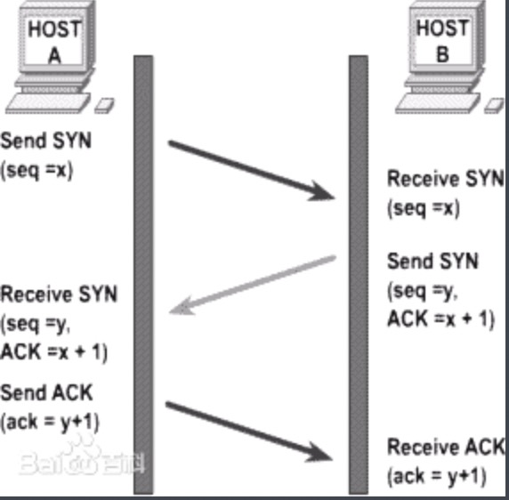
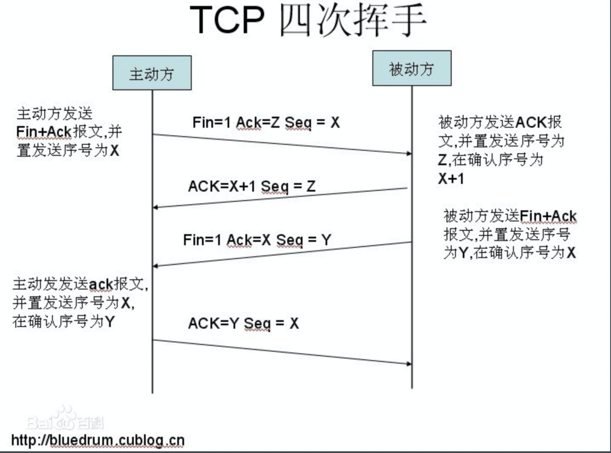
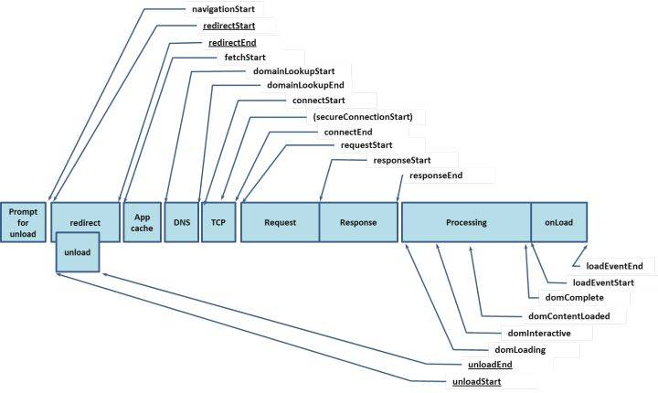
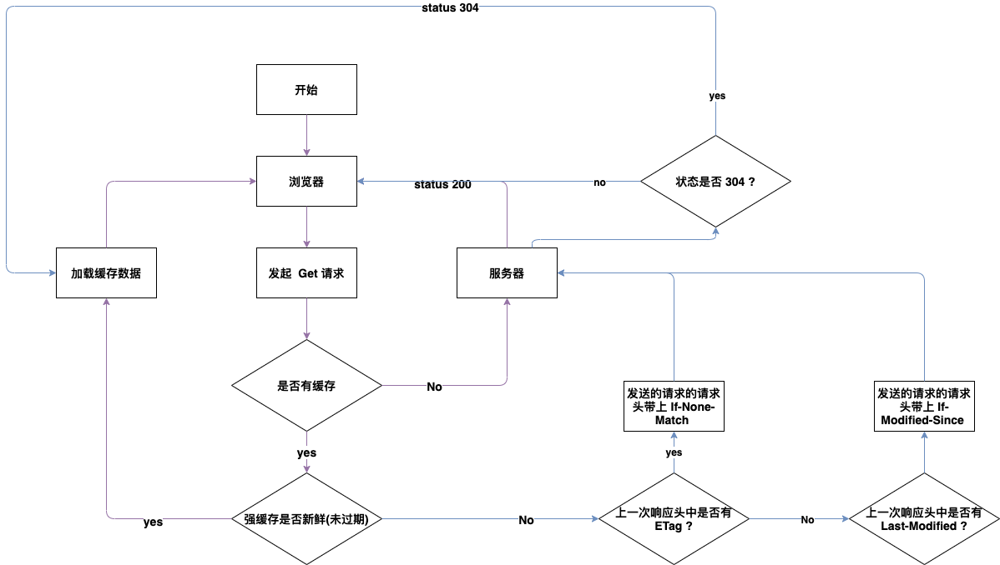

# 前端面试 - JavaScript【基础相关】

[TOC]

## 1. 前端需要注意哪些 SEO ?

1. 网站结构布局 :
    - 控制首页链接数量 网站首页是权重最高的地方。不能过少( "蜘蛛" 不愿爬 )、不能过多(链接过多会影响用户体验，降低页面权重).
    - 扁平化页面结构布局,例如目录结构尽量不超过 3 级( 超过 3 级，"蜘蛛" 就可能不愿意向下爬了 )。
    - 导航优化, 网站导航尽量使用文字，如果需要使用图片则必须添加 alt 和 title 属性, 另外也可以在图片未能正常加载的时候给用户友好体验。
    - 页面头部主要放置(logo 、主导航及用户信息)、页面主体放置(左边放面包屑以及正文,右边放热门文章和相关文章【 可以起到挽留用户，增强页面权重的作用 】)。在设计分页的时候推荐 1 2 3 4 5 6 这种，不推荐 首页
      下一页 尾页 这种、页面底部放置(版权信息和友链)。
    - 把重要的内容放在前面(搜索引擎是从上到下抓取的)。
    - 页面大小最好不超过 100k ， 如果页面加载速度慢可能会遗失部分用户且一旦超时 "蜘蛛" 便不在抓取收录。
2. 代码优化 :
    - 可以利用 title 标签和 meta 标签的 description、keywords 属性来设置关键词和概括页面内容( 并且关键词尽量不要重复出现、关键词也切记过多 )。
    - html 代码书写要符合 W3C 规范( 注重标签语义化 )。
        + a 标签：站内链接要加上 title 属性来告知 "蜘蛛" 和 用户一些链接的关键信息、站外链接要加上 el="nofollow" 属性，告诉 "蜘蛛" 不要去爬。
        + h1 标签：一个页面最多出现 1 个 h1 标签(用于承载站点的最重要的标题或者页面的 logo)。
        + table 标签：表格标签的标题应该使用 \<caption\> 标包裹签来定义。
        + strong 和 em 标签：strong 标签包裹的内容相对于其他标签会引起搜索引擎的重视。em 的强调效果要低于 strong。
        + 文本缩进尽量不使用 `&nbsp;`，而是用 css 来控制。版权符号使用 `&copy;` 而不是直接使用符号 `©`。
        + 尽可能少的使用 js 来动态的渲染内容，因为 "蜘蛛" 抓不到动态渲染的内容(React 和 Vue 大行其道的年代的解决方案另说)。
        + 慎用 `display: none;` "蜘蛛" 可能不会抓取其中的内容，对于不想展示的内容可以 z-index 、偏移度 足够大。
        + 减少使用 iframe，"蜘蛛" 不会去抓 iframe 中的内容。
3. 增加自己的网站的导入链接
4. 提高网站的加载速度( 编码层面、资源加载层面等 )
5. 向各大搜索引擎登录入口提交尚未被搜索引擎收录的链接。
6. 生成站点地图 sitemap

## 2. HTTP 的几种请求方式和用途 ?

**比较常见的 :**

- GET 请求: 获取资源
- POST 请求: 传输实体主体
- PUT 请求: 传输文件
- DELATE 请求: 删除文件
- HEAD 请求: 获得响应报头首部
- OPTIONS 请求: 询问支持的方法

其中有几点需要说明一下 :

1. POST 请求与 PUT 请求很像，比较容易混淆，二者的区别在于 :
   如果是一个更新操作，不会有新的资源产生则使用 PUT 请求，如果有新的资源产生就应该使用 POST 请求<br>
   也即 : GET、POST、PUT、DELATE 分别对应着【 查、增、更、删 】( 这种请求也被称为 REST 风格请求 )

2. OPTIONS 请求平常看不到，在哪可以看到 ? OPTIONS 请求在跨域请求数据的场景中是可以看到的。所以后端针对于浏览器发出真实请求之前的嗅探请求 OPTIONS
   ，就应该做出正确的响应，否则后面的真实的请求是不会发出的。实际上这个 OPTIONS 请求就是一个询问后端支持即将要发送请求属性的程度，如果满足即将发送的请求的发送条件则该请求会在 OPTIONS 请求得到响应之后发送。

3. HEAD 请求也不是常见的请求，代表什么意思 ? 浏览器发送 HEAD 请求是不会有实质的响应体返回的，但会返回响应体首部。

- 通常被用来检查资源的有效性。
- 检查超链接的有效性。
- 检查网页是否被篡改。
- 可用于机器人获取网页标准信息,获取 rss 种子信息或传递安全认证信息。

## 3. 从浏览器地址栏输入 URL 到页面显示的步骤 ?

1. 【 url 解析 】浏览器会对 url 进行解析 :
    - url 包括( 协议、网络地址、资源路径 )
    - 如果是合法地址浏览器会进行相应的操作，如果不是合法地址会转给默认的搜索引擎，由搜索引擎对该字段进行搜索【 就和你直接在谷歌浏览器的地址栏上输入要搜索的内容一样，当 url 不合法的时候一般默认的搜索引擎都会进行类似的搜索 】。
2. 【 DNS 域名解析 】这一步会将 url 中的域名解析成对应的 ip 地址 :
    - 缓存中查找:
        + 先到浏览器的缓存中查找对应的缓存的 DNS 解析记录。
        + 然后再到本机的 host 文件中查找对应的解析记录。
        + 最后到路由器缓存中查找对应的解析记录。
    - DNS 服务器查找:
        + 先向本地 DNS 服务器中查找。
        + 然后进行递归查询( 本地 DNS 服务器向上一级 DNS 服务器请求( 权限域名服务器 -> 定级域名服务器 -> 根域名服务器 )，直至递归请求到根域名服务器 )
3. 【 TCP 3 次握手基于 ip 地址 建立 TCP 连接 】:
    - 客户端向服务端发送 SYN 数据包
    - 服务端接收 SYN 数据包并返回 ( SYN 和 ACK 数据包 )
    - 客户端接收 ( SYN 和 ACK 数据包 ) 并发送 ACK 数据包
      
4. 基于建立好的 TCP 连接，客户端向服务器发送请求。
5. 服务端处理请求并返回响应
6. 【 TCP 4 次挥手断开 TCP 连接 】:
    - 客户端发送 Fin=1 报文、Ack=Z 报文、Seq=X 报文【 (客户端) : 我要关闭 TCP 连接了，如果你那边也关闭的话记得 Ack 告诉我是 X 】
    - 服务器接收客户端传来的报文并返回 Ack = X+1 报文、Seq=Z 报文【 (服务器) : 我这边知道你打算关闭 TCP 连接了，为了让你知，在传 ACK 的时候我会将刚才的 Fin 值 1
      也一并加上并返回，但是我这边数据还没有传送完，所以当我传送完的时候， ACK 我会告诉你是 X 】
    - 服务器发送 Fin=1、Ack=X、Seq=Y 报文【 (服务器) : 我这边数据传输完了，可以关闭了，ACK 给你传了 X，如果你那边已经决定断开则 ACK 给我回传一个 Y 】
    - 客户端发送 Ack=Y、Seq=X 报文【 (浏览器) : 我决定断开了，ACK 给你传个 Y 】
      
7. 浏览器接收响应数据并解析 html 、js、css 等资源
8. 浏览器布局并渲染
9. 页面呈现

## 4. 如何进行网站性能优化 ?

**浏览器处理用户请求的过程 :**

重定向 -> 拉取缓存 -> DNS 查询 -> 建立 TCP 连接 -> 发起请求 -> 接收响应 -> 处理 HTML 元素 -> 元素加载完成


### 一、网络性能优化 :

#### 减少请求次数

**1. 使用缓存**

浏览器的缓存主要分为 `Service Worker Cache`、`HTTP Cache`、`Push Cache`

`Service Worker` 指的是在 Service Worker 这个独立的线程中可以缓存一些资源并通过拦截一些请求来读取缓存、`Push Cache` 缓存与 HTTP 2.0 协议有关，如果前面的 3
种缓存全部没有命中，那么就走 `Push Cache`、`HTTP Cache` 在这里主要说下 :

- HTTP Cache 主要分为 2 种【 强缓存、协商缓存 】
    - 强缓存:
        - 分为(Disk Cache【存储在磁盘】、Memory Cache【存储在内存】)。
        - 所请求的资源是否走强缓存是由 `Expries`、`Cache-Control`、`Pragma` 这 3 个响应 Header 属性来决定的【
          优先级排序: `Expries` < `Cache-Control` < `Pragma` 】。
        - `Expries` 缓存 :
            - 其值是一个 HTTP 日期, 在浏览器发起请求的时候会用当前时间与 `Expries` 的时间进行比对, 如果超出则代表缓存失效。(但是这种方式由于是用当前系统时间来比较所以可能会有不准确的问题)
        - `Cache-Control` 缓存 :
            - 是 HTTP 1.0 新增的属性, 在请求头和响应头中都可以使用，常用值如下 :
                + max-age: 单位是: 秒，当前发起请求的时间距离 max-age 被设置的时间经过的描述如果大于 `max-age` 的值则缓存失效。
                + no-cache: 不适用强缓存，需要与服务器验证缓存是否新鲜( 走协商缓存 )。
                + no-store: 禁止使用缓存(包括协商缓存)，每次请求都向服务器请求最新资源。
                + private: 专用于个人的缓存，中间代理、CDN 等不能缓存此响应
                + public: 响应可以被中间代理、CDN 缓存。
                + must-revalidate: 缓存过期前可以使用，过期后必须向服务器验证。
        - `Pragma` 缓存:
            - 只有一个值【 no-cache 】。即不使用强缓存, 需要与服务器验证缓存是否新鲜( 走协商缓存 )。
    - 协商缓存 :
        - 当强缓存失效或者请求头中设置了不走强缓存，且在请求头中设置了 `If-None-Match` 或 `If-Modified-Since` 会将这两个属性值带去服务器去验证是否命中了协商缓存，如果命中协商缓存会返回 304
          从而加载浏览器缓存，并且响应头会设置 `Last-Modified` 或 `ETag` 属性。



**2. 使用雪碧图**
雪碧图的原理就是: 将多张图片拼在一起总体积比所有图片的体积之和小【 减少了请求次数，但是注意这是针对于同一个页面的，不同页面引用同一个雪碧图地址，还是会向服务器发送请求的 】。<br>
为什么同一个页面的不同部分使用了雪碧图只发送了一次请求呢 ? <br>
是因为第一da次请求将图片下载后直接放到了内存中，再次请求拿到的资源是内存中的资源。但是再次刷新浏览器内存数据清空还是会向服务器发送请求的。
**3. 尽量不要缩放使用图片**
图片最好是使用已经在服务端缩放完毕的图片。

**4. 可以使用字体图标**
如果你的网站需要很多小图标的话，雪碧图又不能满足你的需求，这个时候可以使用字体图标。

#### 提升网络传输速率

**使用 cdn加速**

- 可以在需要的不同地域搭建 cdn。这样可以加载资源的访问速率。
- 在页面中这样设置可以在与页面加载的时候并行进行 dns 预解析(这样页面中某个地方要访问对应链接的时候就不需要等待 dns 解析了因为之前页面加载的时候已经解析过了)。

```js
<meta http-equiv="x-dns-prefetch-control" content="on">

    <link rel="dns-prefetch" href="//www.zhix.net">

        <link rel="dns-prefetch" href="//api.share.zhix.net">

            <link rel="dns-prefetch" href="//bdimg.share.zhix.net">
```

#### 减小请求资源体积

**从请求资源文件方面考虑值得优化的地方就是，webpack 打包 构建资源的时候。**<br>

- 启用 js 压缩

```js
new webpack.optimize.UglifyJsPlugin()
```

- 启用 HTML 压缩

```js
new HtmlWebpackPlugin({
    template: __dirname + '/views/index.html', // new 一个这个插件的实例，并传入相关的参数
    filename: '../index.html',
    minify: {
        removeComments: true,
        collapseWhitespace: true,
        removeRedundantAttributes: true,
        useShortDoctype: true,
        removeEmptyAttributes: true,
        removeStyleLinkTypeAttributes: true,
        keepClosingSlash: true,
        minifyJS: true,
        minifyCSS: true,
        minifyURLs: true,
    },
    chunksSortMode: 'dependency'
})
```

- 在 src 与 href 对应对应的资源的时候可以不写协议，这样也可以起到节省资源的目的。
- 提取公共资源

```js
new webpack.optimize.CommonsChunkPlugin({
    name: 'vendor',
    filename: 'scripts/common/vendor-[hash:5].js'
})
```

- 提取 css 并压缩 在使用 webpack 的时候, 通常会以模块的形式引入 css ,但是上线之前要将这些 css 提取出来并压缩.

```js
const ExtractTextPlugin = require('extract-text-webpack-plugin')
module: {
    rules: [..., {
        test: /\.css$/,
        use: ExtractTextPlugin.extract({
            fallback: 'style-loader',
            use: {
                loader: 'css-loader',
                options: {
                    minimize: true
                }
            }
        })
    }
]
}
```

**服务端给我们传输资源的时候最好启用 gzip 压缩**

### 二、页面渲染性能优化 :

1. 初始渲染的时候 :
   页面下载完毕后会注备渲染页面，渲染之前会对 HTML 进行解析，当解析到 js 的时候会阻塞当前解析的行为。所以 :

- 页面中引入 js 文件的位置最好放在页面的底部，这样不会阻塞 HTML 的解析，如果非要在页面顶部引入 js 文件的话，建议使用 async 属性和 defer 属性( 二者的区别是: 后者是 "在 HTML 解析完毕后执行 js
  文件" 、前者是在页面开始解析 HTML 的时候同时开始加载并执行 js 文件，所以如果涉及到获取 dom 操作的地方最好使用 defer 而不是 async，在页面顶部使用 async 的时候最好不要涉及获取 dom
  操作，最好是操作数据。实际上 defer 也是语 HTML 解析同时加载的但是并不是马上执行而是等到 HTML 解析完毕后才会执行 )。


2. 回流与重绘 :
   **回流(Reflow) :**

> 元素的大小或者位置发生了变化( 当页面布局和几何信息发生变化的时候 ), 触发了重新布局, 导致了渲染树重新计算布局和渲染。

触发回流的条件 :<br>

- 删除或添加可见 dom 元素。
- 元素位置发生了变化。
- 元素尺寸发生变化。
- 内容发生变化( 比如一个图片被另一个不同尺寸的图片所替代 )
- 页面一开始渲染的时候( 无法避免 )
- 浏览器窗口尺寸变化

这里面页面初始渲染的时候是无法避免的。然后可能初始渲染完毕后，js 改变了某个元素在页面中的大小或者位置，则又会触发回流。

**重绘(RePaint) :**
> 元素的(位置、大小、宽高) 不变，但样式改变。<br>
> 比如：【 outline、visibility、color、background-color、box-shadow 】<br>
> 相比较回流来说，重绘不是很消耗性能，但是回流会将 dom 元素的大小位置进行重新计算，然后必然会继续触发重绘【 也即: 重绘不一定会导致回流，但回流一定导致重绘 】

所以在满足产品需求的同时要尽可能的不去直接操作 dom 元素，如果必须那也尽可能的减少回流和重绘。

**怎么避免过多的回流和重绘 :**

- 使用 React、Vue 这种前端框架来完成需求，避免直接操作 dom。因为 框架内部对 dom 的更新所触发的回流与重绘控制的比较好。
- 分离读写 :

  **代码段 1:**
    ```js
    box.style.width = "100px";
    box.style.height = "300px";
    box.style.border = "1px solid #000";
    ```

  **代码段 2:**
    ```js
    box.style.width = "100px";
    box.style.height = "300px";
    console.log(box.offsetWidth);
    box.style.border = "1px solid #000";
    ```

  老版本浏览器中会对 `代码段 1` 进行 3 次回流与重绘。但是新版本浏览器有一个渲染队列机制(
  从上到下找，遇到一个更改样式的代码就将这行代码放到渲染队列中，直到下一行代码不是更改样式的代码后将渲染队列中的所有更改样式的指令一次性的渲染到页面上。 所以 `代码段 1` 中对于现代浏览器而言只是出发了 1 次回流与重绘。 )<br>
  但是有的时候我们需要浏览器中断这种机制，因为某些特定时刻这并不是我们想要的【 比如如下这段代码, 为了出现动画效果不得不中断这种机制 】。

  (看不到动画效果)
    ```js
    box.style.transition = "all 2s";
    box.style.width = "200px";  
    box.style.height = "200px";
    ```

  (可以看到动画效果)
    ```js
    box.style.transition = "all 2s";
    console.log(box.offsetWidth);
    box.style.width = "200px";  
    box.style.height = "200px";
    ```

- 样式集中改变 :
  我们可以将想要 js 动态更改的样式写成 css 类，这样我们可以动态的利用 js 给一个想要动态改变样式的元素动态批量的进行样式的集中更改变了。

- 缓存布局信息 :
  就是通过 js 获取元素的某个属性值用变量存起来，后面再用的时候就直接去找这个变量去拿值了，就不去到 dom 元素上去获取了。
    ```js
    let dynamicHeight = box.offsetHeight;
    box.style.width = `${ dynamicHeight }px`;
    box.style.margainTop = `${ dynamicHeight }px`;
    ```
- 元素批量修改 :
  如果有需要向页面批量添加 dom 元素的需求可以使用 `DocumentFragment` 装起来，一次性渲染到页面，否则每添加一次都有可能触发一次回流与重绘【 现代浏览器默认也是最后批量添加的 】。
    ```js
    let fragment = document.createDocumentFragment();
    for(let i = 0; i < 25; i++) {
        let oLi = document.createElement("li");
        oLi.innerText = `第 ${ i + 1 } 个`;
        fragment.appendChild(oLi);
    }
    ul.appendChild(fragment);
    ```

- 动画效果应用到 position 属性的值为【 absolute、fixed 】身上 :
  因为已经脱离文档流所以不会影响到其他元素，因此虽然不可避免的触发回流与重绘但是计算的过程会大大缩短。

- 做动画的时候开启 硬件加速(GPU 加速) :
  css3 中的一些动画属性是不会触发回流与重绘的，而且动画效果更加顺滑与流畅。 【 transition、opacity、filters ... 】等都会默认开启硬件加速。<br>
  弊端: 过多使用会占用大量内存,性能消耗严重,可能会导致字体模糊。

- 牺牲平滑度换取速度 :
  做动画，如果每次移动 1px 但是需要移动 100px，那么需要移动 100 次，每次都会触发回流与重绘。但是如果每次移动 5px ，只需要移动 20 次，只会触发 20 次的回流与重绘。

- 避免使用 table 布局和 css 里面的 js 计算相关的表达式( calc 等 )


3. 其他方面 :

- 尽量少使用闭包 (可能有造成内存泄露的风险)。
- 事件和定时器使用完要进行清除。
- 编写代码考虑好边界情况避免出现 "死循环" 的情况。
- ...

## 5. HTTP 状态码及其含义 ?

#### 常见状态码:

1XX Informational（请求正在处理）

2XX Success（请求成功）

3XX Redirection（重定向） 需要进行附加操作以完成请求

4XX Client Error（客户端错误）

5XX Server Error（服务器错误）

200 OK 请求正常处理

204 请求处理成功 但是没有任何资源返回给客户端(一般用于只需客户端向服务端发送消息)

206 对资源的某一部分请求 响应报文中包含由 Content-Range 指定范围的实体内容

301永久重定向 如果把资源对应的URI保存为书签，则此时书签会根据Localtion首部字段提示的URI重新保存

302 临时重定向 临时地从旧地址A跳转到地址B

303 和301，302类似 当使用post方法访问一个资源时，把客户端以get的方式重定向到对应的URI，返回303状态码

304 资源已经找到，但是不满足条件，所以不把资源返回给客户端。常用于协商缓存。

400 请求报文内有语法错误

401 该状态码表示发送的请求需要通过HTTP认证，初次收到401响应浏览器弹出认证的对话窗口。若收到第二次401状态码，则说明第一次验证失败。

403 请求资源的访问被服务器拒绝，一般是未获得文件系统的访问权限，访问权限出现问题。

404 服务器上找不到请求资源 或路径错误

405 请求方法被服务端识别，但是服务端禁止使用该方法。可以用OPTIONS来查看服务器允许哪些访问方法

500 服务器端在执行请求时出错，一般是因为web应用出现bug

502 代理服务器或网关从上游服务器中收到无效响应

503 服务器暂时处于超负载或停机维护，目前无法处理请求

## 6. 你能描述下渐进增强和优雅降级之间的不同吗 ?

###### 什么是渐进增强？

就是一开始就针对低版本的浏览器构建页面，完成最基本的功能，然后再针对高级浏览器进行效果，交互，追加各种功能以达到更好用户体验。其实也就相当于向上兼容。

###### 什么是优雅降级？

一开始就构建站点的完整功能，然后针对浏览器测试和修复。比如一开始使用 CSS3 的特性构建了一个应用，然后逐步针对各大浏览器进行 hack 使其可以在低版本浏览器上正常浏览。也就相当于向下兼容。

**相关链接：**
[渐进增强和优雅降级之间的区别在哪里？](https://blog.csdn.net/obkoro1/article/details/70141882)

## 7. 为什么利用多个域名来存储网站资源更有效 ?

1. CDN缓存更方便
2. 突破浏览器并发限制，浏览器一次能发送的http请求是有限的
3. 节约cookie带宽
4. 减少主域名的连接数，优化页面响应速度
5. 防止不必要的安全问题

## 8. 在 CSS/JS 代码上线后我们通常会优化性能, 从用户刷新网页开始, 一次 js 请求一般情况下有哪些地方会有缓存处理 ?

DNS缓存，CDN缓存，浏览器缓存，服务器缓存

**相关链接：**
[一次JS请求一般情况下有哪些地方会有缓存处理](https://www.cnblogs.com/jett-woo/p/12514215.html)

## 9. HTTP 报文结构是怎样的 ?

```html
起始行 + 头部 + 空行 + 实体
```

1. 首行是Request-Line包括：请求方法，请求URI，协议版本，CRLF
2. 首行之后是若干行请求头，包括general-header，request-header或者entity-header，每个一行以CRLF结束
3. 请求头和消息实体之间有一个CRLF分隔
4. 根据实际请求需要可能包含一个消息实体 一个请求报文例子如下：

```html
GET /Protocols/rfc2616/rfc2616-sec5.html HTTP/1.1
Host: www.w3.org
Connection: keep-alive
Cache-Control: max-age=0
Accept: text/html,application/xhtml+xml,application/xml;q=0.9,image/webp,*/*;q=0.8
User-Agent: Mozilla/5.0 (Windows NT 6.1; WOW64) AppleWebKit/537.36 (KHTML, like Gecko) Chrome/35.0.1916.153 Safari/537.36
Referer: https://www.google.com.hk/
Accept-Encoding: gzip,deflate,sdch
Accept-Language: zh-CN,zh;q=0.8,en;q=0.6
Cookie: authorstyle=yes
If-None-Match: "2cc8-3e3073913b100"
If-Modified-Since: Wed, 01 Sep 2004 13:24:52 GMT

name=qiu&age=25
```

**相关链接：**
[（建议精读）HTTP灵魂之问，巩固你的 HTTP 知识体系](https://juejin.cn/post/6844904100035821575)

## 10. 谈谈你对闭包的理解 ?

> 在 JS 忍者秘籍(P90)中对闭包的定义：闭包允许函数访问并操作函数外部的变量。红宝书上对于闭包的定义：闭包是指有权访问另外一个函数作用域中的变量的函数。 MDN 对闭包的定义为：闭包是指那些能够访问自由变量的函数。这里的自由变量是外部函数作用域中的变量。

> 概述上面的话，**闭包是指有权访问另一个函数作用域中变量的函数**

### 闭包的作用

- 保护函数的私有变量不受外部的干扰。形成不销毁的栈内存。
- 保存，把一些函数内的值保存下来。闭包可以实现方法和属性的私有化

### 闭包经典使用场景

-
    1. return 回一个函数

```js
   var n = 10

function fn() {
    var n = 20

    function f() {
        n++;
        console.log(n)
    }

    return f
}

var x = fn()
x() // 21
```

> 这里的 return f, f()就是一个闭包，存在上级作用域的引用。

-
    2. 函数作为参数

```js
var a = '林一一'

function foo() {
    var a = 'foo'

    function fo() {
        console.log(a)
    }

    return fo
}

function f(p) {
    var a = 'f'
    p()
}

f(foo())
```

> 使用 return  <font color="red">fo</font> 返回回来，
> <font color="red">fo()</font> 就是闭包，<font color="red">f(foo())</font> 执行的参数就是函数 <font color="red"></font>fo，因为 <font color="red">fo()</font> 中的 a 的上级作用域就是函数<font color="red">foo()</font>，所以输出就是<font color="red">foo</font>

### 使用闭包需要注意什么

> JavaScript 是静态作用域的设计，闭包是为了解决子函数晚于父函数销毁的问题，我们会在父函数销毁时，把子函数引用到的变量打成 Closure 包放到函数的 [[Scopes]] 上，让它即使父函数销毁了也随时随地能访问外部环境。

> 容易导致内存泄漏。闭包会携带包含其它的函数作用域，因此会比其他函数占用更多的内存。过度使用闭包会导致内存占用过多，所以要谨慎使用闭包。

## 11. 谈谈你对作用域的理解 ?

> 在 JavaScript 里面，函数、块、模块都可以形成一个存放变量的独立空间.他们之间可以相互嵌套，作用域之间会形成引用关系，这条链叫做作用域链。

**相关链接：**  
[JavaScript 的静态作用域链与“动态”闭包链](https://juejin.cn/post/6957913856488243237#heading-1)

## 12. 你知道 JavaScript 中的原型吗 ? 原型链又是什么 ? 有什么特点 ?

弄明白js中原型、原型链是理解js继承，new关键字原理，甚至封装组件、优化代码的前提条件。

<font color='red'>我们首先需要理解两个概念：</font>

1. js分为函数对象和普通对象，每个对象都有__proto__属性，但是只有函数对象才有prototype属性
2. Object、Function都是js内置的函数, 类似的还有我们常用到的Array、RegExp、Date、Boolean、Number、String

<font color='red'>那么__proto__和prototype到底是什么，两个概念理解它们</font>

3. 属性__proto__是一个对象，它有两个属性，constructor和__proto__；
4. 原型对象prototype有一个默认的constructor属性，用于记录实例是由哪个构造函数创建；

#### 什么是JavaScript 原型对象

用构造方法创建一个新的对象之后，这个对象中默认会有一个属性 `__proto__`, 这个属性就指向了构造方法的原型对象。 原型对象的作用，是用来存放实例中共有的那部份属性、方法，可以大大减少内存消耗。

#### 什么是JavaScript 原型链

JavaScript中所有的对象都是由它的原型对象继承而来。而原型对象自身也是一个对象，它也有自己的原型对象，这样层层上溯，就形成了一个类似链表的结构，这就是原型链（prototype chain）。
所有原型链的终点都是Object函数的prototype属性

**相关链接：**  
[轻松理解JS 原型原型链](https://juejin.cn/post/6844903989088092174#heading-1)

## 13. 请解释什么是事件委托/代理 ?

[简述JS中的事件委托和事件代理](https://www.jianshu.com/p/a77d8928c5c9)

## 14. JavaScript 如何实现继承 ?

**继承的本质就是复制。**

1. 原型链继承（了解原型链后就知道，通过原型链就可以在JavaScript中实现继承）
2. 借用构造函数继承
3. 组合继承
4. 原型式继承
5. 寄生式继承
6. 寄生组合式继承
7. 混入方式继承多个对象
8. ES6类继承extends

**具体实现看链接：**  
[JavaScript常用八种继承方案](https://juejin.cn/post/6844903696111763470)

## 15. 谈谈你对 this 对象的理解

- 普通的this：指向调用这个函数的对象。
- 作为对象方法：指向调用对象的父级
- call、apply、bind都能改变this指向

## 16. new 操作符具体做了什么 ?

> `new` 运算符创建一个用户定义的对象类型的实例或具有构造函数的内置对象的实例。
> 说的直白点，就是用来创建不同类型的对象。不然只能通过字面量创建对象，想想就很可怕，当然字面量创建的对象底层也是通过 new Object()来实现的。

#### 具体做了什么 ?

1. 创建一个空对象。
2. 该对象的隐式原型指向该函数的原型。
3. 这个新对象会绑定到函数调用的this。
4. 如果函数没有返回其他对象，那么 new 表达式中的函数调用会自动返回这个新对象。

**相关链接：**  
[new 到底都做了什么事情](https://juejin.cn/post/6950673570196357156)

## 17. 请简单说说 ajax 原理 ?

#### 什么是Ajax ?

> Ajax是一种异步请求数据的web开发技术，对于改善用户的体验和页面性能很有帮助。简单地说，在不需要重新刷新页面的情况下，Ajax 通过异步请求加载后台数据，并在网页上呈现出来。

#### 原理:

Ajax的工作原理相当于在用户和服务器之间加了—个中间层(AJAX引擎)
，使用户操作与服务器响应异步化。并不是所有的用户请求都提交给服务器。像—些数据验证和数据处理等都交给Ajax引擎自己来做,，只有确定需要从服务器读取新数据时再由Ajax引擎代为向服务器提交请求。

## 18. ajax 、axios、fetch 的区别 ?

#### ajax

> 全称`Asynchronous JavaScript and XML`（异步的 JavaScript 和 XML）最早出现的发送后端请求技术，隶属于原始js中，核心使用XMLHttpRequest对象，多个请求之间如果有先后关系的话，就会出现回调地狱。

#### Axios:

> Axios本质上也是对原生XHR的封装，只不过它是Promise的实现版本，符合最新的ES规范;它不但可以在客户端使用，也可以在nodejs端使用。Axios也可以在请求和响应阶段进行拦截。

#### fetch:

> 符合关注分离，没有将输入、输出和用事件来跟踪的状态混杂在一个对象里;更加底层，提供的API丰富（request, response） 脱离了XHR，是ES规范里新的实现方式

## 19. 你在项目中是如何解决跨域的 ?

#### 几种跨域解决方案：

1. JSONP实现跨域
2. CORS实现跨域
    - 实现CORS通信的关键是服务器。只要服务器实现了CORS接口，就可以跨源通信。
    ```
   浏览器在头信息中增加一个Origin字段，从而发出CROS请求
   要支持CORS访问需要服务器在响应头中添加Access-Control-Allow-Origin，可以使用*来表示允许所有域跨域访问。
    ```

3. vue项目开发使用proxyTable 解决开发环境的跨域

- 在webpack项目中我们使用ProxyTable来实现跨域。示例：

```js
module.exports = {
    devServer: {
        proxy: {
            '^/api': {
                target: 'http://localhost:4000/api',// 可以是一个指向开发环境 API 服务器的字符串
                ws: true,
                changeOrigin: true, // 如果接口跨域，需要进行这个参数配置
                pathRewrite: { // pathRewrite方法重写url
                    '^/api': '/'
                }
            }
        }
    }
}
```

4. nginx反向代理接口跨域

## 20. 为什么要有同源限制？

同源策略指的是：协议，域名，端口相同，同源策略是一种安全协议,现在所有支持JavaScript 的浏览器都会使用这个策略
举例说明：比如一个黑客程序，他利用Iframe把真正的银行登录页面嵌到他的页面上，当你使用真实的用户名，密码登录时，他的页面就可以通过Javascript读取到你的表单中input中的内容，这样用户名，密码就轻松到手了。

## 21. JavaScript 中哪些操作会导致内存泄漏 ?

1. 意外的全局变量引起的内存泄漏
2. 闭包引起的内存泄漏
3. 没有清理的DOM元素引用，比如：button,image,text
4. 被遗忘的定时器或者回调

## 22. XML 与 JSON 的区别?

+ 数据体积方面
    - JSON相对于XML来讲，数据的体积小，传递的速度更快些。
+ 数据交互方面
    - JSON与JavaScript的交互更加方便，更容易解析处理，更好的数据交互
+ 数据描述方面
    - JSON对数据的描述性比XML较差
+ 传输速度方面
    - JSON的速度要远远快于XML

## 23. 谈谈你对 Webpack 的理解 ?

+ WebPack
  是一个模块打包工具，你可以使用WebPack管理你的模块依赖，并编绎输出模块们所需的静态文件。它能够很好地管理、打包Web开发中所用到的HTML、Javascript、CSS以及各种静态文件（图片、字体等），让开发过程更加高效。对于不同类型的资源，webpack有对应的模块加载器。webpack模块打包器会分析模块间的依赖关系，最后
  生成了优化且合并后的静态资源

## 24. 说说你对 AMD 和 CommonJS 的理解 ?

+ CommonJS是服务器端模块的规范，Node.js采用了这个规范。CommonJS规范加载模块是同步的，也就是说，只有加载完成，才能执行后面的操作。AMD规范则是非同步加载模块，允许指定回调函数

+ AMD推荐的风格通过返回一个对象做为模块对象，CommonJS的风格通过对module.exports或exports的属性赋值来达到暴露模块对象的目的

## 25. 常见的 Web 安全及防护原理 ?

+ `sql`注入原理就是通过把SQL命令插入到Web表单递交或输入域名或页面请求的查询字符串，最终达到欺骗服务器执行恶意的SQL命令

+ 总的来说有以下几点
    - 永远不要信任用户的输入，要对用户的输入进行校验，可以通过正则表达式，或限制长度，对单引号和双"-"进行转换等
    - 永远不要使用动态拼装SQL，可以使用参数化的SQL或者直接使用存储过程进行数据查询存取
    - 永远不要使用管理员权限的数据库连接，为每个应用使用单独的权限有限的数据库连接
    - 不要把机密信息明文存放，请加密或者hash掉密码和敏感的信息

#### XSS原理及防范

Xss(cross-site scripting)
攻击指的是攻击者往Web页面里插入恶意html标签或者javascript代码。比如：攻击者在论坛中放一个看似安全的链接，骗取用户点击后，窃取cookie中的用户私密信息；或者攻击者在论坛中加一个恶意表单，当用户提交表单的时候，却把信息传送到攻击者的服务器中，而不是用户原本以为的信任站点

#### XSS防范方法

首先代码里对用户输入的地方和变量都需要仔细检查长度和对”<”,”>”,”;”,”’”等字符做过滤；其次任何内容写到页面之前都必须加以encode，避免不小心把html tag 弄出来。这一个层面做好，至少可以堵住超过一半的XSS 攻击

#### XSS与CSRF有什么区别吗？

XSS是获取信息，不需要提前知道其他用户页面的代码和数据包。CSRF是代替用户完成指定的动作，需要知道其他用户页面的代码和数据包。要完成一次CSRF攻击，受害者必须依次完成两个步骤 登录受信任网站A，并在本地生成Cookie
在不登出A的情况下，访问危险网站B

#### CSRF的防御

服务端的CSRF方式方法很多样，但总的思想都是一致的，就是在客户端页面增加伪随机数 通过验证码的方法

## 26. 你使用过哪些设计模式 ? 能说说他们的特点吗 ?

#### 工厂模式：

- 工厂模式解决了重复实例化的问题，但还有一个问题,那就是识别问题，因为根本无法 主要好处就是可以消除对象间的耦合，通过使用工程方法而不是new关键字

#### 构造函数模式

- 使用构造函数的方法，即解决了重复实例化的问题，又解决了对象识别的问题，该模式与工厂模式的不同之处在于 直接将属性和方法赋值给 this对象;

## 27. offsetWidth/offsetHeight 与 clientWidth/clientHeight 与 scrollWidth/scrollHeight 之间的区别 ?

- offsetWidth/offsetHeight返回值包含content + padding + border，效果与e.getBoundingClientRect()相同
- clientWidth/clientHeight返回值只包含content + padding，如果有滚动条，也不包含滚动条
- scrollWidth/scrollHeight返回值包含content + padding + 溢出内容的尺寸

## 28. 请列举几个常见的浏览器兼容性问题 ?

1. 浏览器默认的margin和padding不同。
2. cursor:hand 显示手型在safari 上不支持
3. 透明度的兼容CSS设置

```css
.transparent_class {
    filter: alpha(opacity=50);
    -moz-opacity: 0.5;
    -khtml-opacity: 0.5;
    opacity: 0.5;
}  
```

## 29. 说说你对 Promise 的理解 ? 可以简单说说实现原理吗 ?

promise是为解决异步处理回调金字塔问题而产生的

#### Promise的两个特点

1. Promise对象的状态不受外界影响;Promise 有以下三种状态：
    + pending 初始状态
    + fulfilled 成功状态
    + rejected 失败状态
2. Promise的状态一旦改变，就不会再变，任何时候都可以得到这个结果，状态不可以逆，只能由 pending变成fulfilled或者由pending变成rejected

#### Promise的三个缺点

1. 无法取消Promise,一旦新建它就会立即执行，无法中途取消
2. 如果不设置回调函数，Promise内部抛出的错误，不会反映到外部
3. 当处于pending状态时，无法得知目前进展到哪一个阶段，是刚刚开始还是即将完成

相关链接：
[谈谈我对Promise的理解](https://www.jianshu.com/p/002003a38e89)

## 30. 你对 node.js 熟悉吗 ? 能说说他的特点吗 ?

1. 它是一个Javascript运行环境
2. 依赖于Chrome V8引擎进行代码解释
3. 事件驱动
4. 非阻塞I/O
5. 单进程，单线程

优点： 高并发（最重要的优点）

缺点：

1. 只支持单核CPU，不能充分利用CPU
2. 可靠性低，一旦代码某个环节崩溃，整个系统都崩溃

## 31. 请说出几条 JavaScript 的基本规范 ?

```
  1. 一个函数作用域中所有的变量声明应该尽量提到函数首部，用一个 var 声明，不允许出现两个连续的 var 声明，声明时如果变量没有值，应该给该变量赋值对应类型的初始值，便于他人阅读代码时，能够一目了然的知道变量对应的类型值。
 
  2. 在进行比较的时候吧，尽量使用'===', '!=='代替'==', '!='
 
  3. 代码中出现地址、时间等字符串时，尽量使用常量代替
  
  4. switch 语句必须带有 default 分支。

  5. if 语句必须使用大括号。

  6. for 循环必须使用大括号。
``` 

## 32. JavaScript 中有个 eval ，他是用来做什么的 ?

```
它的功能是把对应的字符串解析成 JS 代码并运行。

应该避免使用 eval，不安全，非常耗性能（2次，一次解析成 js 语句，一次执行）。
```

相关链接：
[《eval()》](https://developer.mozilla.org/zh-CN/docs/Web/JavaScript/Reference/Global_Objects/eval)

## 33. ["1", "2", "3"].map(parseInt) ?

```
parseInt() 函数能解析一个字符串，并返回一个整数，需要两个参数 (val, radix)，其中 radix 表示要解析的数字的基数。（该值介于 2 ~ 36 之间，并且字符串中的数字不能大于 radix 才能正确返回数字结果值）。

此处 map 传了 3 个参数 (element, index, array)，默认第三个参数被忽略掉，因此三次传入的参数分别为 "1-0", "2-1", "3-2"

因为字符串的值不能大于基数，因此后面两次调用均失败，返回 NaN ，第一次基数为 0 ，按十进制解析返回 1。
```

相关链接：
[《为什么 ["1", "2", "3"].map(parseInt) 返回 [1,NaN,NaN]？》](https://blog.csdn.net/justjavac/article/details/19473199)

## 34. 谈谈你对 ES6 的理解 ?

```
ES6， 全称 ECMAScript 6.0 ，2015.06 发版。

ES6 主要是为了解决 ES5 的先天不足，比如 JavaScript 里并没有类的概念，
但是目前浏览器的 JavaScript 是 ES5 版本，大多数高版本的浏览器也支持 ES6，不过只实现了 ES6 的部分特性和功能。
```

**请列举几个ES6新增的部分特性与方法**：

```
1. 展开操作符 （…）
   
2. let 和 const 命令

3. 变量的解构赋值

4.模板字符串（template string）是增强版的字符串，用反引号（``;）标识。它可以当作普通字符串使用，也可以用来定义多行字符串，或者在字符串中嵌入变量。

5.Promise 对象

6.Proxy

7. 箭头函数
```

相关链接：  
[深入理解ES6](https://blog.csdn.net/sophia_little/article/details/79442571)  
[阮一峰——ECMAScript 6 入门](https://es6.ruanyifeng.com/#)

## 35. 谈谈你对 Web 标准中的 可用性、可访问性、可维护性的理解 ?

```
可⽤性（Usability）：产品是否容易上⼿，⽤户能否完成任务，效率如何，以及这过程中 ⽤户的主观感受可好，是从⽤户的⻆度来看产品的质量。可⽤性好意味着产品质量⾼，是企业的核⼼竞争⼒ 

可访问性（Accessibility）：Web内容对于残障⽤户的可阅读和可理解性

可维护性（Maintainability）：⼀般包含两个层次，⼀是当系统出现问题时，快速定位并解 决问题的成本，成本低则可维护性好。⼆是代码是否容易被⼈理解，是否容易修改和增强 功能。

```

## 36. 谈谈 let 与 var 的区别 ?

```
1. 作用域不同，let命令只在所在的代码块内有效；let实际上为 JavaScript 新增了块级作用域。

2. let不能在定义之前访问该变量，但是var可以(变量提升)。

3. let不允许在相同作用域内，重复声明同一个变量。
```

## 37. 谈谈 forEach 与 map 的区别 ?

```
forEach方法，是最基本的方法，就是遍历与循环，默认有3个传参：分别是遍历的数组内容item、数组索引index、和当前遍历数组Array

map方法，基本用法与forEach一致，但是不同的，它会返回一个新的数组，所以在callback需要有return值，如果没有，会返回undefined 
```

## 38. 请列举常见的异步编程方式

1. 回调函数

```js
f1();
f2();

//如果f1是一个很耗时的任务，可以考虑改写f1，把f2写成f1的回调函数。
function f1(callback) {
    setTimeout(function () {
        // f1的任务代码
        callback();
    }, 1000);
}

//执行代码就变成下面这样：
f1(f2);

```

2. 事件监听


3. 发布/订阅模式（publish-subscribe pattern），又称"观察者模式"（observer pattern）


4. Promises

## 39. for、for in、for of、forEach 这几个数组迭代方法的区别 ?

### forEach介绍

```js
objArr.forEach(function (value) {
    console.log(value);
});
```

> foreach 方法没办法使用 `break` 语句跳出循环，或者使用`return`从函数体内返回

### for-in介绍

```js
for (var index in objArr) {
    console.log(objArr[index])
}
```

> 以上代码会出现的问题：
>1. index 值 会是字符串（String）类型
>2. 循环不仅会遍历数组元素，还会遍历任意其他自定义添加的属性，如，objArr上面包含自定义属性，objArr.name，那这次循环中也会出现此name属性
>3. 某些情况下，上述代码会以随机顺序循环数组

> for-in循环设计之初，是给普通以字符串的值为key的对象使用的。而非数组。

### for-of介绍

```js
for (let value of objArr) {
    console.log(value)
}
```

> 1. 可以避免所有 for-in 循环的陷阱
>2. 不同于 forEach()，可以使用 break, continue 和 return
>3. for-of 循环不仅仅支持数组的遍历。同样适用于很多类似数组的对象
>4. 它也支持字符串的遍历
>5. for-of 并不适用于处理原有的原生对象

###### for-of 遍历 Set

```js
var uniqueWords = new Set(words);

for (var word of uniqueWords) {
    console.log(word);
}
```

for-of 遍历 Map

```js
for (var [key, value] of phoneBookMap) {
    console.log(
        key + "'s phone number is: " + value);
} 
```

> Map是键值对组成，需要用到 Es6新特性解构

for-of 遍历原生对象

```js
// 输出对象自身可以枚举的值 
for (var key of Object.keys(someObject)) {
    console.log(key + ": " + someObject[key]);
}
```

## 40. 如何渲染几万条数据而不卡住页面 ?

```
可以使用setInterval和setTimeout、requestAnimationFrame来实现定时分批渲染
```

## 41. JavaScript 中怎样添加、移除、移动、复制和查找节点 ?

- appendChild() // 添加
- removeChild() // 移除
- replaceChild() // 替换
- insertBefore() // 插入
- cloneNode() //复制节点
- 查找

```
getElementsByTagName() //通过标签名称

getElementsByClassName() //通过元素的class属性名称

getElementById() //通过元素 Id，唯一性
```

## 42. 谈一谈箭头函数与普通函数的区别 ?

箭头函数相当于匿名函数，并且简化了函数定义；不过箭头函数和匿名函数有个明显的区别：箭头函数内部的this是词法作用域，由上下文确定。

- 函数体内的this对象，就是定义时所在的对象，而不是使用时所在的对象
- 不可以当作构造函数，也就是说，不可以使用new命令，否则会抛出一个错误
- 不可以使用arguments对象，该对象在函数体内不存在。如果要用，可以用Rest参数代替
- 不可以使用yield命令，因此箭头函数不能用作Generator函数

## 43. window.onload 与 $(document).ready 有什么不同 ?

1.执行时间

```
window.onload必须等到页面内包括图片的所有元素加载完毕后才能执行。
$(document).ready()是DOM结构绘制完毕后就执行，不必等到加载完毕。 
```

2.编写个数不同

```
window.onload不能同时编写多个，如果有多个window.onload方法，只会执行一个
$(document).ready()可以同时编写多个，并且都可以得到执行
```

3.简化写法

```
window.onload没有简化写法
$(document).ready(function(){})可以简写成$(function(){});
```

## 44. addEventListener 与 attachEvent 的区别 ?

1. 适应的浏览器版本不同
2. 针对的事件不同
3. 参数的个数不同
4. 执行事件的优先级不同
5. 对this的引用不同

## 45. 你在项目中遇到数组去重的需求是怎么实现的(方案越多越好) ?

1. ES6 最常用Set 去重
2. 双重for循环
3. indexOf或includes去重
4. filter去重

[手写JS！各种姿势解数组去重和数组扁平化](https://juejin.cn/post/6950307682737717261)

## 46. 都说 js 是单线程的 ? 那什么是单线程 ? 他和异步的关系 ?

> 单线程就是同时只能做一件事，两段js不能同时执行
>
> 原因：避免 DOM 渲染的冲突

如果JS中不存在异步,只能自上而下执行,万一上一行解析时间很长,那么下面的代码就会被阻塞。 对于用户而言,阻塞就意味着"卡死",这样就导致了很差的用户体验；所以JS可以通过事件循环(event loop)实现'异步'
调用一个函数并没有立即执行,而是延迟了一段时间,满足一定条件后,才去执行的,这类代码,我们叫异步代码。

> 同步可以保证顺序一致，但是容易导致阻塞；异步可以解决阻塞问题，但是会改变顺序性，根据不同的需要去写你的代码。

## 47. 谈谈你对浏览器环境中的 Event Loop 的理解 ?

###### JS的执行机制是:

- 首先判断js代码是同步还是异步,同步就进入主进程,异步就进入`event table`
- 异步任务在event table中注册函数,当满足触发条件后,被推入`event queue`
- 同步任务进入主线程后一直执行,直到主线程空闲时,才会去event queue中查看是否有可执行的异步任务,如果有就推入主进程中

以上三步循环执行,这就是event loop

[https://www.ruanyifeng.com/blog/2013/10/event_loop.html](https://www.ruanyifeng.com/blog/2013/10/event_loop.html)

## 48. 现在要你实现一个 Dialog 组件, 说说你的思路 ?

1. 首先在开发之前考虑到以下几点：

> 组件标题，按钮文案，按钮个数、弹窗内容均可定制化;
>
>弹窗垂直水平居中;
>
>遮罩层和弹窗内容分离，点击遮罩层关闭弹窗;
>
>多个弹窗同时出现时弹窗的z-index要比之前的要高;
>
>点击遮罩层关闭弹窗和处理弹窗底部的页面内容不可滚动.

###### 实现思路（以vue为例子）：

1. 完成页面结构和样式；先创建一个弹窗组件vue文件，实现基本的结构与样式。


2. 定制弹窗标题、按钮和主体内容;将标题设置为可定制化传入，且为必传属性。
    - 按钮默认显示一个确认按钮，可以定制化确认按钮的文案，以及可以显示取消按钮，并且可定制化取消按钮的文案，以及它们的点击事件的处理。
    - 主体内容建议使用slot插槽处理。
    
3. 组件开关；弹窗组件的开关由外部控制， 默认不显示 必传属性  

4. z-index处理，保证弹窗组件的层级z-inde足够高，其次要确保弹窗内容的层级比弹窗遮罩层的层级高。

> 具体可参考el-dialog的实现方式： https://github.com/ElemeFE/element/tree/dev/packages/dialog

## 49. 是否知道自定义事件 ?
js 一般事件像是click、blur、focus等等。除了这些之外还可以自己定义事件，但是自定义事件同样需要自己定义触发机制
自定义事件相当于是 观察者模式，可以把复杂逻辑解耦，代码可以写的很清晰，而且很容易复用。

[JavaScript 自定义事件如此简单](https://juejin.cn/post/6844904069820055560)  
[JavaScript 自定义事件](https://juejin.cn/post/6844903953549770765)
## 50. js栈和堆

为了更好容易的理解堆和栈，首先来复习一下js中的数据类型。 在js中数据类型主要分为以下两大类：
> - 基本类型：undefined、Null、Boolean、Number、 String、Symbol、BigInt，这几种基本数据类型它们是直接按值存放的，所以可以直接访问。
> - 引用类型：RegExp、Math、Date、Function、Array，当我们需要访问这5种引用类型的值时，首先得从栈中获得该对象的地址指针，然后再从堆内存中取得所需的数据。

#### 什么是堆什么是栈 ?

> 栈(stack): 由操作系统自动分配内存空间，自动释放，存储的是基础变量以及一些对象的引用变量，占据固定大小的空间。
> 堆(heap)：由操作系统动态分配的内存，大小不定也不会自动释放，一般由程序员分配释放，也可由垃圾回收机制回收。

#### 堆和栈的区别

> 传值和传址：从一个向另一个变量复制引用类型的值，复制的其实是指针，因此两个变量最终指向同一个对象。即复制的是栈中的地址而不是堆中的对象。 从一个变量复向另一个变量复制基本类型的值，会创建这个值的副本。
